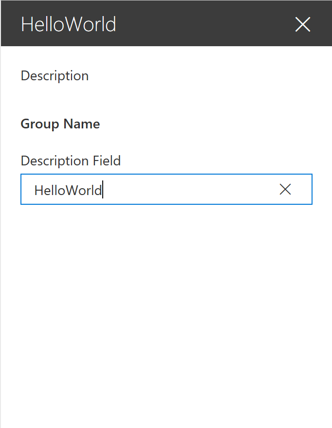

This is an easy one, but I keep Googling it.

When you create an SPFx web part, the default Property Pane automatically submits changes to the web part. There is no “Apply” button.



Default property pane — no Apply button

But sometimes you don’t want changes to the property pane fields to automatically apply.

All you have to do is to add this method in your web part class (just before

getPropertyPaneConfiguration is where I like to place it):

```typescript
protected get disableReactivePropertyChanges(): boolean {
 return true;
}
```

When you refresh the web part, your property pane will sport a fancy Apply button!


Property pane with an Apply button

Property changes in the property pane will only get applied when users hit **Apply**.

That’s it!
