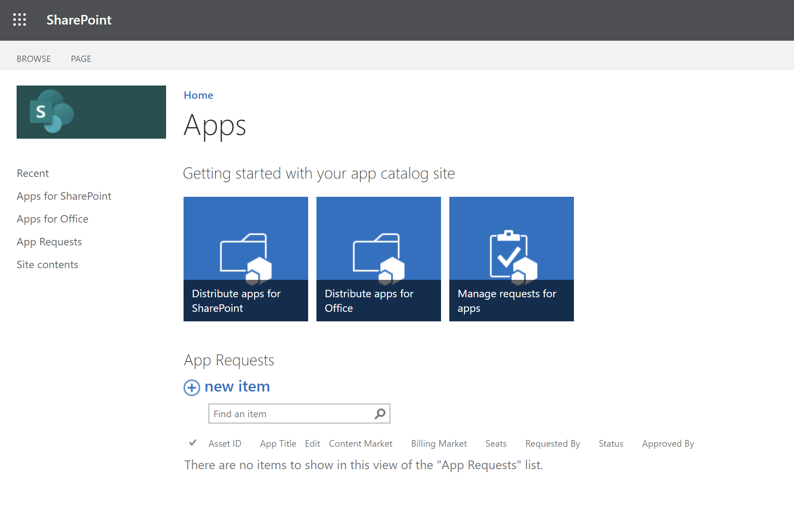

## Introduction

A while ago, I wrote an SPFx Application Customizer that allows you to insert custom CSS on your SharePoint modern pages and [posted about it](https://tahoeninja.blog/2018/05/08/inject-custom-css-on-sharepoint-modern-pages-using-spfx-extensions/).

The solution is now a sample in the SharePoint [SharePoint Framework Extensions Samples & Tutorial Materials](https://github.com/pnp/sp-dev-fx-extensions/tree/master/samples/react-application-injectcss) repo.

I received lots of feedback, comments and questions about the article so I decided to write an [updated article](https://tahoeninja.blog/2018/10/29/update-inject-custom-css-on-sharepoint-modern-pages-using-spfx-application-extensions/) to answer the most frequently asked questions.

I have since updated the solution to SPFx 1.8 and created a simple automated deployment script to (hopefully) reduce issues.

This blog post walks you through how to deploy your custom CSS using the deployment scripts and use the application extender to inject custom CSS on SharePoint.

This blog post focuses on deploying the **pre-packaged** version of the application extender. The source code is available for anyone who wishes to create their own version of the solution; if you want to build your own version, I encourage you to read the README.MD in the [solution’s repository](https://github.com/pnp/sp-dev-fx-extensions/tree/master/samples/react-application-injectcss).

You’ll need to follow 3 steps:

```mermaid
graph LR
A[Prepare CSS] ==>B(Deploy solution)
B ==> C[Activate Application Customizer]
```

## Prepare your CSS

> Fair warning: you should customize your SharePoint CSS as a last resort. If this was a feature that Microsoft wanted to support, they would have built it in already. Do not call Microsoft (or me, for that matter) to complain that your custom CSS broke your SharePoint pages.

First things first, you should prepare your custom CSS by following these steps:

1. Using your favorite file editor, create a custom CSS file that meets your needs. For example, this CSS will change the feedback button’s background color to orange.

```css
.sitePage-uservoice-button {
    background-color: orange;
    }
```

2. Upload the CSS file as **custom.css** to your **Styles Library** of the root site collection (i.e.: `https://<your-tenant>.sharepoint.com/Style%20Library/Forms/AllItems.aspx`).

>   For example, the CSS provided above will make the feedback button appear as follows:  
>   

If you need help finding what CSS classes you should change, read the [last update](https://tahoeninja.blog/2018/10/29/update-inject-custom-css-on-sharepoint-modern-pages-using-spfx-application-extensions/) where I provide some steps.

## Deploy the solution

Deploying the solution adds the application extension to your app catalog. Once the application extension is in your app catalog, you can add it to your sites — either one site at a time, or all sites at once.

There are two ways to deploy the solution:

- Manually
- Using PowerShell

Before you begin either, download the [pre-packaged solution](https://github.com/hugoabernier/react-application-injectcss/releases/download/1.2.0/react-application-injectcss.sppkg).

You will also need to know your tenant’s app catalog. The app catalog is where you can deploy custom and third-party solutions for your SharePoint tenant.

### Finding your app catalog URL

If you don’t know where your **App Catalog** is, you can find out using the [PnP PowerShell Cmdlets](https://aka.ms/sppnp-powershell) and running the following commands from your PowerShell console:

1. Connect to your tenant (make sure to replace `yourtenant` with your own tenant name):

    ```powershell
    connect-pnponline https://yourtenant.sharepoint.com -UseWebLogin
    ```

    Adding `-UseWebLogin` will use the Office 365 browser-based login window, which is crucial if your tenant uses two-factor authentication. You can omit it if you’d like.

2. Get your tenant’s app catalog URL:

    ```powershell
    Get-PnPTenantAppCatalogUrl
    ```

The URL it returns is the URL to your app catalog site collection. If it returns nothing, your tenant doesn’t have an app catalog configured. Follow [these steps from Microsoft](https://docs.microsoft.com/sharepoint/use-app-catalog) to configure your tenant’s app catalog.  
  
You can get to your app catalog by selecting **Apps for SharePoint** in the site navigation (or selecting **Distribute apps for SharePoint** on the home page.

Your app catalog should look a little like this (except that it may be empty):  


### Manual Deployment

1. Upload the **react-application-injectcss.sppkg** you downloaded from the [pre-packaged solution](https://github.com/hugoabernier/react-application-injectcss/releases/download/1.2.0/react-application-injectcss.sppkg) or drag and drop the file onto the library.  
    
2. In the **Do you trust react-application-inject-client-side-solution?** dialog, select whether you want to **Make this solution available to all sites in the organization** or not, the select **Deploy**. As long as you trust me, of course.  
    

> NOTE: as per Henry Radke’s comments on my previous post, make sure to use _https://_ not _http://_ when you upload the solution to your app catalog. Thanks Henry for the tip!

### Automated deployment

1. If you have not done so already, install the [PnP PowerShell Cmdlets](https://aka.ms/sppnp-powershell)
2. Download the **DeployApplicationCustomizer.ps1** PowerShell script from the [GitHub repo](https://github.com/hugoabernier/react-application-injectcss/releases/download/1.2.0/DeployApplicationCustomizer.ps1). You should save it in the same folder as the **react-application-injectcss.sppkg** you downloaded from the [pre-packaged solution](https://github.com/hugoabernier/react-application-injectcss/releases/download/1.2.0/react-application-injectcss.sppkg).
3. Edit the **DeployApplicationCustomizer.ps1** file and change line 1 to point to your tenant. You should be replacing `<your-tenant>` for your own tenant name.
4. From a PowerShell console, run the **DeployApplicationCustomizer.ps1** script. The script will make the extension available to **all sites**.
5. You will be prompted to enter your credentials.
6. After providing your credentials, the extension will be deployed

## Activate Application Customizer

If you selected **Make this solution available to all sites in the organization** or used the automated deployment option above, the extension should already be activated for all sites.

> NOTE: It can take up to 20 minutes for the application customizer extension to activate on all sites. Be patient.

### Verifying a tenant-wide extension

If you wish, you can verify that the extension is activated tenant-wide using the following steps:

1. From your **App Catalog** site collection, select **Site contents** from the site navigation
2. In the **Site contents**, select **Tenant Wide Extensions**
3. From the **Tenant Wide Extensions** list, you should see one entry called **InjectCSS**  
    

### Activating extension for a site

If you wish to activate the application customizer extension on a site-by-site basis, you’ll need to use the following steps:

1. Download the **EnableApplicationCustomizer.ps1** from the [GitHub repo](https://github.com/hugoabernier/react-application-injectcss/releases/download/1.2.0/EnableApplicationCustomizer.ps1).
2. On line 3, change `<your-tenant>` to your actual tenant.
3. On the same line, change `<your-site>` to the site URL for the site where you want to activate the extension.
4. The PowerShell script assumes that you uploaded the CSS as **custom.css** to your **Styles Library** of the root site collection (i.e.: `[https://<your-tenant&gt](https://<your-tenant&gt/);.sharepoint.com/Style%20Library/Forms/AllItems.aspx`). If you chose a different name or path, make sure to change line 1 to match the location of your custom CSS.
5. Run the PowerShell script.
6. You will be prompted to enter credentials.
7. Once you provide your credentials, the application customizer extension will be activated on your site.

## Conclusion

My **InjectCSS** application customizer extension allows you to inject custom CSS on your SharePoint tenant.

Remember to use this feature responsibly; Microsoft may change the page structure and CSS classes at any time, which may break your customizations.

Thank you to all who sent me emails, tweets, GitHub issues and left feedback on my previous posts. I am always happy to help (but be prepared to get a lecture about how you should only make CSS changes as a last resort).

I would love to see what customizations you have done. Leave some comments!

I hope this helps?