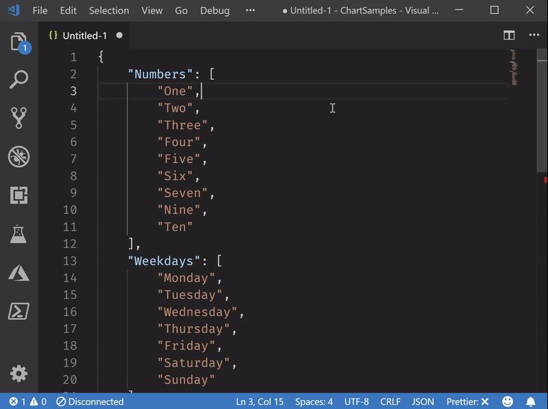
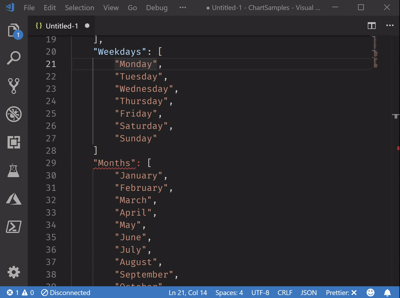
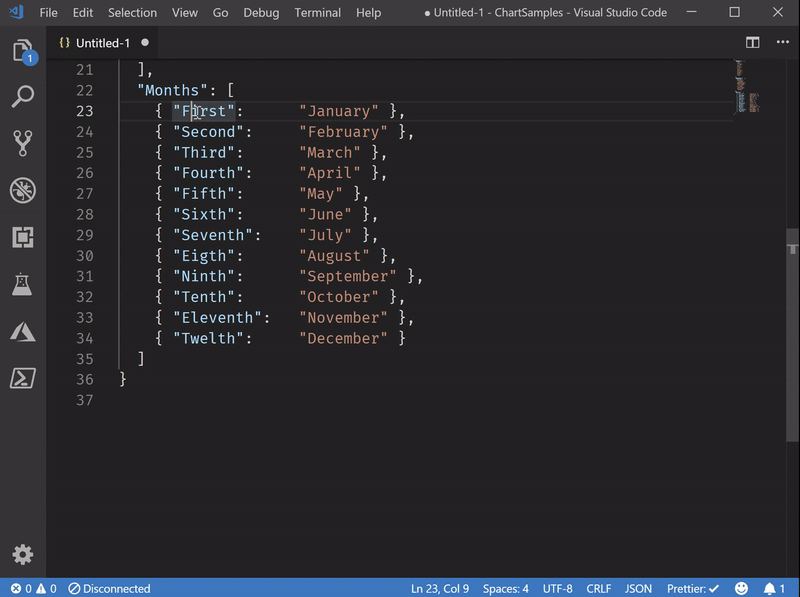
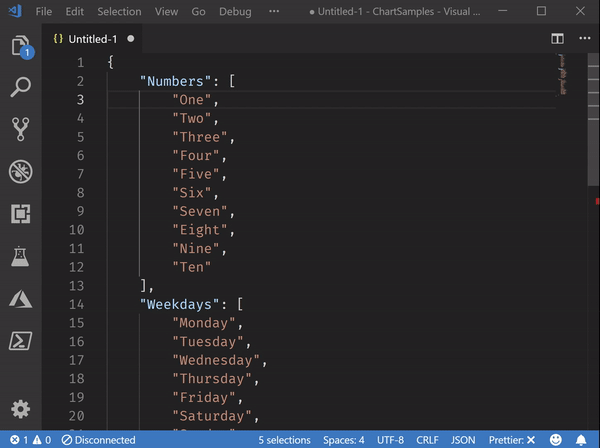
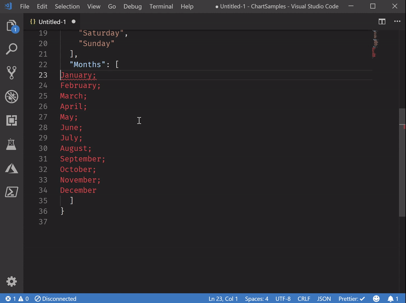

## Introduction

A few days ago, I was showing a co-worker on how to localize a web part using SPFx. I had a series of words to copy and move into a JSON structure.

I selected the whole text and inserted a `"` in front of every word, a `"` after every word, and a `,` at the end of every line in about 5 keystrokes.

> HOW DID YOU DO THAT?!

"HOW DID YOU DO THAT?!" my co-worker asked, inappropriately too loud for a quiet office setting.

I could have produced a rabbit from the computer and he wouldn’t have been more impressed.

He had never used multi-cursor editing before — or, apparently, seen anyone use it.

Then I remembered another time, a few months ago, when I had shown the same feature to a friend of mine. Someone that I have looked up to and respected for over 15 years, who has more to teach me than I could ever teach him. He had said, "you should blog about this!".

I had completely forgotten about it.

This article will demonstrate how to use multi-cursor editing. I don’t think it is particularly earth-shattering, but I do hope that someone else will learn ways to save some keystrokes.

## Multiple Cursors in Visual Studio Code for Windows

Multiple cursors is a feature that is available out-of-the-box within Visual Studio Code. (It is also available in Visual Studio, but some of the shortcut keys are different).

You use multiple cursors by creating multiple cursors in your editing window (selecting all instances of text you wish to edit), and editing your text.

Once you have multiple cursors in place, you can move them just like you would a single cursor, by using the arrow keys.

To go back to single-cursor editing, just hit <kbd>ESCAPE</kbd>.

It takes a while to get used to it, but once you get the hang of it, it can save you quite a bit of time.

### CTRL+ALT+ ↑ / ↓: Select next/previous line

If you have a bunch of text in consecutive lines, you can simply start on a line and add cursors on the lines before or after by using <kbd>CTRL</kbd>-<kbd>ALT</kbd>-<kbd>↑</kbd> or <kbd>CTRL</kbd>-<kbd>ALT</kbd>-<kbd>↓</kbd>.

### ALT-CLICK: Create cursors

If you want to insert multiple cursors throughout a document that aren’t on consecutive lines, you can simply hold <kbd>ALT</kbd> and click on each line.

### CTRL-U: Undo last cursor operation

Picture this: you carefully selected over one hundred lines by alt-clicking and — as you get ready to click on the last line — you click on the _wrong line_. You may think that alt-clicking again will deselect the line, but you’d be wrong. And _don’t_ try to let go of the <kbd>ALT</kbd> key to de-select the wrong line because you’ll lose your entire selection!

Simply hit <kbd>CTRL</kbd>-<kbd>U</kbd> to under your last cursor operation. You can continue hitting <kbd>CTRL</kbd>-<kbd>U</kbd> to undo more cursor operations.

### CTRL-SHIFT-L: Select current match

You can insert cursors in every instance of the selected text by clicking <kbd>CTRL</kbd>-<kbd>SHIFT</kbd>-<kbd>L</kbd>. It saves you from having to manually find every instance of a word and Alt-click on every word. Fast!

### CTRL-F2: Select current word

To select all instances of the current _word_ hit <kbd>CTRL</kbd>-<kbd>F2</kbd>.

### SHIFT-ALT-→ / ←: Expand/shrink selection

If you select a word and want to include the quotes (or brackets, or anything that surrounds a word), you can use <kbd>SHIFT</kbd>-<kbd>ALT</kbd>-<kbd>→</kbd> to expand your selection. For example, if your cursor is in the middle of every word, hitting <kbd>SHIFT</kbd>-<kbd>ALT</kbd>-<kbd>→</kbd> will select the entire words. Hitting <kbd>SHIFT</kbd>-<kbd>ALT</kbd>-<kbd>→</kbd> again will select the quotes around each word, and it will continue extending the selection every time you hit <kbd>SHIFT</kbd>-<kbd>ALT</kbd>-<kbd>→</kbd>. To shrink your selection, using <kbd>SHIFT</kbd>-<kbd>ALT</kbd>-<kbd>←</kbd>.

## Rectangular Selections

You can use _rectangular selections_ to edit … well, rectangular areas of text.

### SHIFT-ALT-Drag: Create rectangular selection

If you hold <kbd>SHIFT</kbd> and <kbd>ALT</kbd> while dragging your mouse, it will create a rectangular selection area, regardless whether there is text under the selection or not.

### SHIFT-ALT-CTRL-Arrows: Create rectangular selection (keyboard-only)

You can also select a rectangular area from your current cursor position by using your arrow keys while holding <kbd>SHIFT</kbd>-<kbd>ALT</kbd>-<kbd>CTRL</kbd>.

You can also use <kbd>SHIFT</kbd>-<kbd>ALT</kbd>-<kbd>CTRL</kbd>-<kbd>PG UP</kbd> and <kbd>SHIFT</kbd>-<kbd>ALT</kbd>-<kbd>CTRL</kbd>-<kbd>PG DN</kbd> to extend your rectangular selection by an entire page.

## Other shortcuts to use with multi-cursor

These shortcut key combinations are not unique to multi-cursor editing, but — when used with multi-cursor editing — they can be quite useful.

### CTRL-L: Select entire line

You can select the entire line where your cursor(s) sit by hitting <kbd>CTRL</kbd>-<kbd>L</kbd>.

### CTRL-→ / ←: Select to word boundary

Holding <kbd>CTRL</kbd> while using the left and right arrow will move the cursor to the next word boundary. A word boundary is anything that’s not an alpha-numeric character, like space, quote, hyphen, etc. If you hold <kbd>SHIFT</kbd> while doing <kbd>CTRL</kbd>-<kbd>→</kbd> or <kbd>CTRL</kbd>-<kbd>←</kbd>, it will _select_ from your current cursor position to the next word boundary.

## Conclusion

Editing multiple with cursors in Visual Studio Code allows you to increase productivity by reducing repetitive steps and keystrokes.

I hope that you’ll enjoy using multiple cursors in the future!

