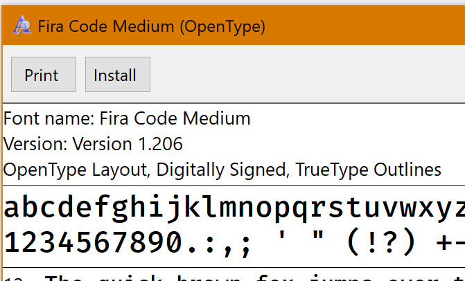
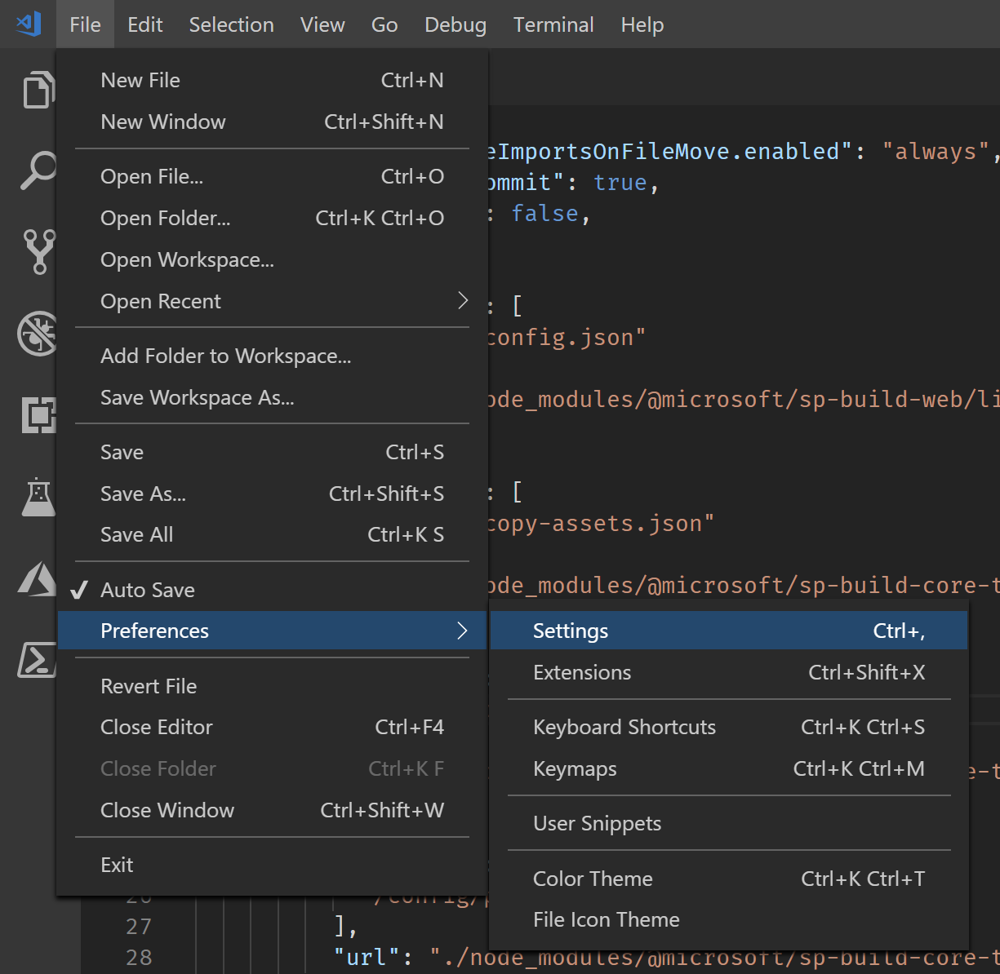

## Introduction

I recently published the [list of developer tools that I use as a SharePoint Framework developer](/2019/03/14/ultimate-developer-tool-list-for-spfx/). The list was inspired from [Scott Hanselman’s own list](https://www.hanselman.com/tools) — he deserves all the credit for the idea.

I received tons of great feedback about the article, and many of you gave me great suggestions. Thanks to everyone for helping, and I hope that — together — we can make a list that anyone starting with SPFx can use as a starting port.

[Sam Culver](https://twitter.com/samculver) kindly pointed out that the Fira Code font makes a great choice for the default font in Visual Studio Code:

> Sam Culver (@samculver)  
> Replying to @bernierh and @vesajuvonen  
> Fira Code is also great in Visual Studio Code

He’s absolutely right! I have it as my default font and I thought I should show the _very simple steps_ to configure it as your default font in Visual Studio Code.

## To configure Fira Code as your default Visual Studio Code font

1. If you haven’t done so, [download Fira Code](https://github.com/tonsky/FiraCode) and install it by following these steps:  
    1.1. Extract the Zip file you just downloaded  
    1.2. In the files you just extracted, find and open the **ttf** folder  
      
    1.3. For every **.ttf** file in that folder, double-click to install the font.  
    
2. Once you have installed the fonts, open **Visual Studio Code**. If you already had Visual Studio Code opened, you will need to restart it before it can use the newly installed fonts.
3. From the **Visual Studio Code** menu, select **File** | **Preferences** | **Settings**. Alternatively, press `CTRL+,`  
    
4. From the **Settings** window, under **Commonly Used**, find the **Editor: Font Family** setting.
5. In the text box, replace what is there for **‘Fira Code’** (including the single quotes). Alternatively, you can simply add **‘Fira Code’,** at the start of the existing setting. You’ll end up with **‘Fira Code’, Consolas, ‘Courier New’, monospace**.

Keep the settings open if you want to enable font ligatures…

## Enabling font ligatures

_Font ligatures_ is a typography term to describe when two or more characters (or _graphemes_) are joined as a single _glyph_. For example, instead of: `===` you’ll get: 

It can help make your code more legible (and thus easier to spot bugs). Take a look at this example from FiraCode’s [GitHub repo](https://github.com/tonsky/FiraCode):  

Some people love ligatures. Some people can’t stand them.

If you’d like to use ligatures, follow these steps:

1. From the **Settings** page in Visual Studio Code, scroll to the **Text Editor** | **Font** section and look for **Font Ligatures**. (Or search for **Ligatures** in the search box).
2. Check the checkbox labelled **Enables/Disables font ligatures**.

That’s it.

Just uncheck the box if you _don’t_ want ligatures anymore.

## Conclusion

Enabling Fira Code as your default Visual Studio Code font is incredibly easy, and barely deserves its own blog post.

I wish to thank [Sam Culver](https://twitter.com/samculver) for reminding me that I should document this. Sometimes I just tend to configure things on auto-pilot and I don’t even notice it!

I hope that you’ll enjoy Fira Code and ligatures in Visual Studio Code, and I hope that this will become one of those settings that you end up automatically doing without having to think about it.

If you like the idea of ligatures, but you aren’t a fan of Fira Code, the good folks at Fira Code list [some alternative fonts](https://github.com/tonsky/FiraCode#alternatives) you may like.

Also, if you enjoy Fira Code, you should consider [supporting them](https://patreon.com/tonsky)
