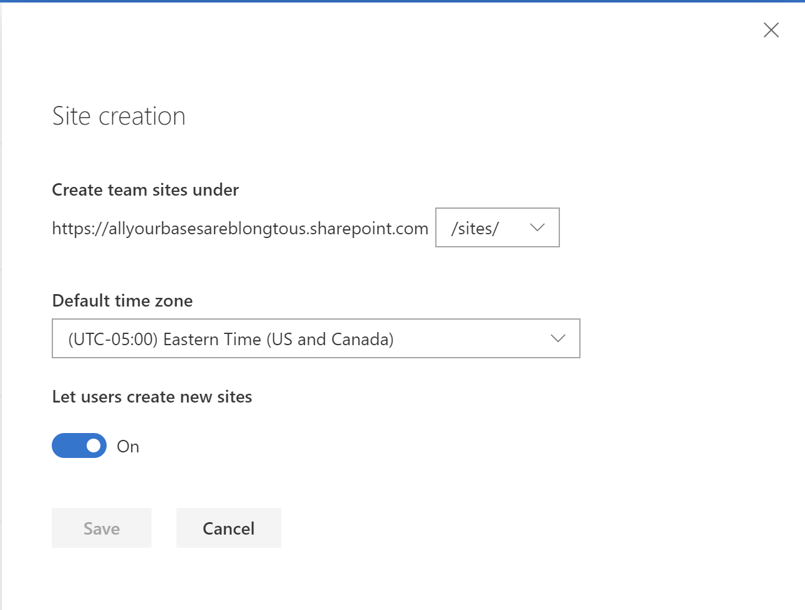

## Introduction

Every once in a while, I write a blog post as a note to myself about something that I couldn’t find easily with the hope that next time I (or someone else in need) look for it, it’ll be easy to find.

This is the case with this one.

Yesterday, I was helping to set up a new Office 365 tenant for a company that has their head offices in Toronto.

We created some sites and used the [SharePoint Online Provisioning Service](https://provisioning.sharepointpnp.com/) but found it annoying that the time zone for every site was **UTC -8**. We wanted **UTC -5**, or Eastern Standard Time as our default time zone.

It’s almost as if the company that wrote this product was based in Seattle, or something.

But when it came time to set the default time zone, I couldn’t remember where the setting was. I’ve done it so many times before, but it was as if all my past with all the previous versions of SharePoint got mixed together. Throw in the additional confusion by considering the differences between the on-premises and online versions, and I just could not remember where it was.

This post is to make sure I don’t have to look it up anymore.

## Finding the setting

My brain is too small to remember things that I can look up or easily deduce. The location of the setting for the default time zone for new SharePoint sites is not something easily deduced.

I clicked around and couldn’t find the setting. It must’ve been a case of **demo blindness**, _a condition that often occurs in professional consultants during demos where they can’t see something that it plainly in front of them_.

I eventually searched it online and found [an article](https://sympmarc.com/2018/09/14/set-default-site-time-zone-in-office-365/) that [Mark D. Anderson](https://sympmarc.com/author/mdenton22/), someone I respect immensely, wrote in 2018.

The setting is in the **SharePoint Admin Center** (located at [https://\*\*yourtenant\*\*-admin.sharepoint.com/](https://**yourtenant**-admin.sharepoint.com/)), under **Settings** and **Site Creation** (site creation is the last setting on that page):

In the **Site Creation** pane, you’ll find **Default time zone**:  
.

Select the time zone you want and select **Save**.

Note that this setting will _not_ overwrite the time zone setting for existing sites. It will only affect new sites created after you apply the setting.

## Conclusion

The setting is in the **SharePoint Admin Center**, under **Settings** and **Site Creation**.
