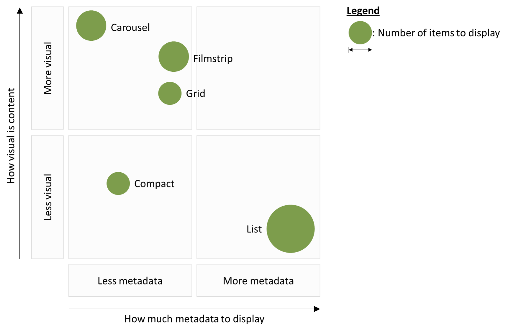
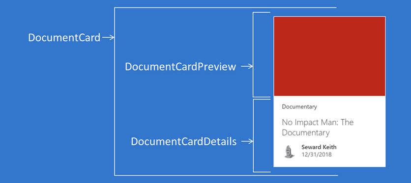
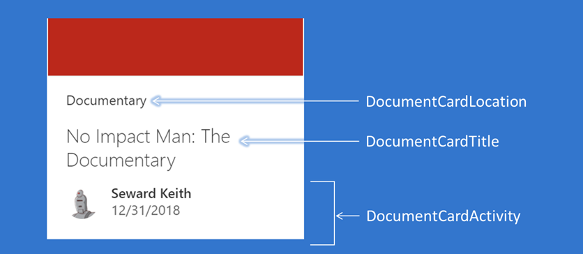
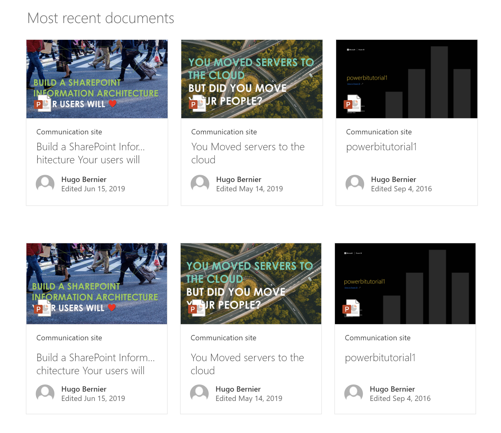

## Introduction

The [SharePoint Design](https://spdesign.azurewebsites.net/) is a beautiful web site that provides design guidance on beautiful and fast sites, pages, and web parts with SharePoint in Office 365.

Unfortunately, the SharePoint Design site does not tell you _how_ to create the beautiful web parts they show you.

[This series](/2019/07/08/introducing-the-sharepoint-framework-design-series/) is intended as a companion to the SharePoint Design site, providing you with code samples and detailed _how-to_ information for every design topic. It should help you create web parts that look exactly like the ones on the SharePoint Design site.

In today’s post, we’ll begin discussing the [web part layout patterns](https://docs.microsoft.com/sharepoint/dev/design/layout-patterns).

## SharePoint web part layouts

If you look at the various web parts that are available out-of-the-box on SharePoint, you’ll find that there are many different layouts for web parts.

In fact, there are 5 commonly-used layouts:

- Grid
- Filmstrip
- List
- Carousel
- Compact


5 common web part layouts

Each layout is best suited for different uses.

## How to decide which layout to use

When planning your web part design, you can pick the best layout by considering the following criteria:

- **How "visual" is the content:** does the content consist of a picture or a document preview (more visual), or is it mostly text (less visual)?
- **How much metadata to display:** Do you need to simply provide a title, author, date and maybe a category (like most out-of-the-box web parts do) or do you need to provide more metadata?
- **Number of items to display:** Do you want to display only a few items, or do you need to display many items at once.

To help the decision process, I use the following matrix which places the standard layouts against a grid of how visual and how much metadata you wish to display. The size of each circle helps to compare how many items you want to display — the bigger the circle, the more items you can show.



You should also consider how much space you’ll have on a page and the size of the page.

> "But I don’t have control over the content and size of the page!"

…I can already hear some of you say. You’re absolutely right! That’s why you should consider giving your authors a few layout options so that they can pick the layout that is best suited for their page designs.

Luckily, you don’t have to write multiple versions of the same code to offer multiple layouts; Most of the layouts re-use the same/similar components.

For example:

- The **Grid** layout and the **Filmstrip** layout are essentially the same, except that the **Grid** wraps content over multiple rows, where the **Filmstrip** keeps items on a single row.
- The **Filmstrip** turns into a **Carousel** when there are more items to show that what can be displayed on a single screen.
- The **Grid** turns into a **Compact** layout when the screen is too small

The easiest way to demonstrate this is probably with code!

## Grid layout

The grid layout presents content in rectangular areas in rows and columns from left to right and top to bottom. The grid layout will attempt to fit as many columns as possible and resize the _grid items_, or individual content elements within the grid, to fit the entire width of the grid.

When the grid resizes, it re-flows the grid items by keeping the same number of columns but making each column narrower. When the columns become too narrow, the grid will remove one column and resize the remaining columns to fit within the grid.

When there is only room for 1 column within the grid (e.g.: when viewed on a mobile device or if the web part is located in a one-third column), the grid layout will change to a compact layout.


The grid layout re-flows content in rows and columns

## Creating a grid layout web part

Unfortunately, there isn’t a readily-usable grid layout component that you can use in your web parts. The [Office UI Fabric GitHub repo](https://github.com/OfficeDev/office-ui-fabric-react) has a component called [`TileList`](https://github.com/OfficeDev/office-ui-fabric-react/tree/master/packages/experiments/src/components/TilesList) which gives you a grid layout, but it is still in the **experiments** package which contains "not production-ready components and should never be used in \[production code\]". I’m not sure if Microsoft ever plans on moving the `TileList` component to the main Office UI Fabric component, but if they do, I’ll update this article and code sample accordingly.

Instead, I created a `GridList` component that uses the Office UI Fabric [`List`](https://developer.microsoft.com/fabric#/controls/web/list) component and made a few modifications to make it look like a grid layout. I used the code from the [List of 5000 grid items sample](https://developer.microsoft.com/fabric#/controls/web/list) on the [UI Fabric web site](https://developer.microsoft.com/en-us/fabric) as the base for my code.

You can find the code in the `src/components/GridList` folder from [my repository](https://github.com/hugoabernier/WebPartDesignSeries/tree/master/WebPartLayouts).

The control reacts the same way as the out-of-the-box grid layout. It even handles compact layouts:


### Using the GridList component in your web part

Here’s how to call the `GridList` component in your web part:

1. If you haven’t done so already, copy the content of the `src/components/GridList` folder from [the sample code](https://github.com/hugoabernier/WebPartDesignSeries/tree/master/WebPartLayouts) to your own project’s `src/components/GridList`.
2. In your `src/webparts/[YourWebPartName]/components/[[YourWebPartName].tsx`, retrieve the items you wish to display. To simplify this sample, I used a hard-coded list of items. I am too lazy (and unimaginative) to come up with my own sample data, so I used [Mockaroo.com](https://mockaroo.com/) to generate a JSON structure that contains the items I wanted. I saved the items to my component’s `state` in the constructor, as follows:

```typescript
export default class GridLayout extends React.Component<IGridLayoutProps, IGridLayoutState> {
  constructor(props: IGridLayoutProps) {
    super(props);

    this.state = {
      items: [{
  thumbnail: "https://pixabay.com/get/57e9dd474952a414f1dc8460825668204022dfe05555754d742e7bd6/hot-air-balloons-1984308_640.jpg",
  title: "Adventures in SPFx",
  name: "Perry Losselyong",
  profileImageSrc: "https://robohash.org/blanditiisadlabore.png?size=50x50&set=set1",
  location: "SharePoint",
  activity: "3/13/2019"
}, {
  thumbnail: "https://pixabay.com/get/55e8d5474a52ad14f1dc8460825668204022dfe05555754d742d79d0/autumn-3804001_640.jpg",
  title: "The Wild, Untold Story of SharePoint!",
  name: "Ebonee Gallyhaock",
  profileImageSrc: "https://robohash.org/delectusetcorporis.bmp?size=50x50&set=set1",
  location: "SharePoint",
  activity: "6/29/2019"
}, {
  thumbnail: "https://pixabay.com/get/57e8dd454c50ac14f1dc8460825668204022dfe05555754d742c72d7/log-cabin-1886620_640.jpg",
  title: "Low Code Solutions: PowerApps",
  name: "Seward Keith",
  profileImageSrc: "https://robohash.org/asperioresautquasi.jpg?size=50x50&set=set1",
  location: "PowerApps",
  activity: "12/31/2018"
}, {
  thumbnail: "https://pixabay.com/get/55e3d445495aa514f1dc8460825668204022dfe05555754d742b7dd5/portrait-3316389_640.jpg",
  title: "Not Your Grandpa's SharePoint",
  name: "Sharona Selkirk",
  profileImageSrc: "https://robohash.org/velnammolestiae.png?size=50x50&set=set1",
  location: "SharePoint",
  activity: "11/20/2018"
}, {
  thumbnail: "https://pixabay.com/get/57e6dd474352ae14f1dc8460825668204022dfe05555754d742a7ed1/faucet-1684902_640.jpg",
  title: "Get with the Flow",
  name: "Boyce Batstone",
  profileImageSrc: "https://robohash.org/nulladistinctiomollitia.jpg?size=50x50&set=set1",
  location: "Flow",
  activity: "5/26/2019"
}]
    };
  }
```

3. Define your component’s `props` and `state` interfaces so that you have what you need to retrieve and store the items you wish to display (my `props` in this sample does not require anything so I left it empty):

```typescript
export interface IGridLayoutProps {
// Add your own props here
}

export interface IGridLayoutState {
  items: IGridItem[];
}
```

4. Define an interface to hold the properties for the items you wish to display. For my sample, I used the following interface:

```typescript
export interface IGridItem {
  thumbnail: string;
  title: string;
  name: string;
  profileImageSrc: string;
  location: string;
  activity: string;
}
```

5. In your `src/webparts/[YourWebPartName]/components/[[YourWebPartName].tsx`, `onRender` method, insert a `GridList` element, as follows:

```typescript
public render(): React.ReactElement<IGridLayoutProps> {
    return (
      <div className={styles.gridLayout}>
        <GridList
          items={this.state.items}
          onRenderGridItem={(item: any, finalSize: ISize, isCompact: boolean) => this.onRenderGridItem(item, finalSize, isCompact)}
        />
      </div>
    );
  }
```

6. Make sure to add an import for the `GridList` at the top of your file:

```typescript
import { GridList } from '../../../components/gridList';
```

Note that your `GridList` element uses a method called `onRenderGridItem` which isn’t defined yet. We’ll do this next.

### Using the `DocumentCard` component to render grid items

Typically, grids use _cards_ to showcase content, but you can also use any rectangular content you wish to use.

In our sample code, we’ll use Fabric UI [`DocumentCard`](https://developer.microsoft.com/fabric#/controls/web/documentcard) components to render our content.

Our `DocumentCard` elements will contain two sub-elements:

- `DocumentCardPreview`: which will contain a preview image of the item
- `DocumentCardDetails`: which will contain further details



The `DocumentCardDetails` itself contains more elements:

- `DocumentCardTitle`: The title of the element
- `DocumentCardLocation`: The "location" of the element. Often used to indicate an item’s category or sub-title.
- `DocumentCardActivity`: Used to indicate the item’s latest activities, such as date last modified and last modified by



The `DocumentCardActivity` defines the following props:

- `activity`: Describes the activity that has taken place, such as "Created Feb 23, 2020".
- `people`: One or more people who are involved in this activity. Each person consists of the following two props:
  - `name`: The person’s name you wish to display
  - `profileImageSrc`: The URL for the person’s profile picture.

You can define more properties, but that’s what I used for this sample. If you want to see the full list of properties, look at the `IDocumentCardActivityPerson` interface, and the `IDocumentCardActivityProps` interface on the [Fabric UI documentation](https://developer.microsoft.com/fabric#/controls/web/documentcard).

When the `GridList` wants to render a grid item, it will call your `onRenderGridItem` handler with three parameters:

- `item`: The item it wants to render
- `finalSize`: Size of the item to render
- `isCompact`: Returns `true` if the grid is rendering in a compact mode.

If you return a `DocumentCard` element within every grid item, you’ll do something like this:

```typescript
private onRenderGridItem = (item: any, finalSize: ISize, isCompact: boolean): JSX.Element => {
    const previewProps: IDocumentCardPreviewProps = {
      previewImages: [
        {
          previewImageSrc: item.thumbnail,
          imageFit: ImageFit.cover,
          height: 130
        }
      ]
    };

    return <div
      className={styles.documentTile}
      data-is-focusable={true}
      role="listitem"
      aria-label={item.title}
    >
      <DocumentCard
        onClick={(ev: React.SyntheticEvent<HTMLElement>) => alert(ev)} >
        <DocumentCardPreview {...previewProps} />
        <DocumentCardLocation location={item.location} />
        <DocumentCardDetails>
          <DocumentCardTitle
            title={item.title}
            shouldTruncate={true}
          />
          <DocumentCardActivity
            activity={item.activity}
            people={[{ name: item.name, profileImageSrc: item.profileImageSrc }]}
          />
        </DocumentCardDetails>
      </DocumentCard>
    </div>;
  }
```

Make sure to add the following imports otherwise, your code will be sad:

```typescript
// Used to render document cards
import {
  DocumentCard,
  DocumentCardActivity,
  DocumentCardPreview,
  DocumentCardDetails,
  DocumentCardTitle,
  IDocumentCardPreviewProps,
  DocumentCardLocation,
  DocumentCardType
} from 'office-ui-fabric-react/lib/DocumentCard';
import { ImageFit } from 'office-ui-fabric-react/lib/Image';
```

Note that in my code, I simply display an alert when someone clicks on a grid item. In your real code, you’ll want to replace `onClick={(ev: React.SyntheticEvent<HTMLElement>) => alert(ev)}` with your own `onClick` handler.

Notice that, in our previous code, we don’t really use the `isCompact` parameter. It is passed to tell us whether we should render the grid using a compact layout or not.

Luckily, the `DocumentCard` component has a built-in compact layout that you can use by simply passing `type={DocumentCardType.compact}` if the `DocumentCard` should be compact. The default `type` for the `DocumentCard` is `DocumentCardType.normal`.

To handle the compact rendering, I’ll simply change the `DocumentCard`‘s `type` depending on whether we’re rendering in compact mode or not:

```typescript
   <DocumentCard
        type={isCompact ? DocumentCardType.compact : DocumentCardType.normal}
        onClick={(ev: React.SyntheticEvent<HTMLElement>) => alert(ev)}

      >
```

Finally, the out-of-the-box grid layouts tend to remove unnecessary information when rendering in compact mode (otherwise, there would just be too much stuff). The `DocumentCardLocation` is often omitted in compact mode. To mimic this behavior, I only render the `DocumentCardLocation` if the layout isn’t compact, using the following code:

```typescript
{!isCompact && <DocumentCardLocation location={item.location} />}
```

Which makes the final code for your `onRenderGridItem` as follows:

```typescript
private onRenderGridItem = (item: any, finalSize: ISize, isCompact: boolean): JSX.Element => {
    const previewProps: IDocumentCardPreviewProps = {
      previewImages: [
        {
          previewImageSrc: item.thumbnail,
          imageFit: ImageFit.cover,
          height: 130
        }
      ]
    };

    return <div
      className={styles.documentTile}
      data-is-focusable={true}
      role="listitem"
      aria-label={item.title}
    >
      <DocumentCard
        type={isCompact ? DocumentCardType.compact : DocumentCardType.normal}
        onClick={(ev: React.SyntheticEvent<HTMLElement>) => alert(ev)}

      >
        <DocumentCardPreview {...previewProps} />
        {!isCompact && <DocumentCardLocation location={item.location} />}
        <DocumentCardDetails>
          <DocumentCardTitle
            title={item.title}
            shouldTruncate={true}
          />
          <DocumentCardActivity
            activity={item.activity}
            people={[{ name: item.name, profileImageSrc: item.profileImageSrc }]}
          />
        </DocumentCardDetails>
      </DocumentCard>
    </div>;
  }
```

If all goes well, you get something like this:  


### Putting the finishing touches

If you replace the sample data from above with real data, your web part should be barely distinguishable from the out-of-the-box web parts.

For example: in the screen shot below, the top web part is the out-of-the-box **Highlighted content** web part, while the bottom one is my own, using (almost) the exact same code as show in this post.



The only differences are:

- My web part needs a title (that’s easy to fix, just follow the instructions in [my previous post](/2019/07/10/sharepoint-framework-design-series-web-part-titles-and-descriptions/))
- In my `onRenderGridItem`, I added an `iconSrc` parameter to my `previewProps` to point to the document’s icon, as follows:

```typescript
const previewProps: IDocumentCardPreviewProps = {
      previewImages: [
        {
          previewImageSrc: item.thumbnail,
          imageFit: ImageFit.cover,
          height: 130,
          iconSrc: item.iconSrc
        }
      ]
    };
```

And, of course, I used an API call to retrieve the latest documents instead of returning hard-coded data.

## Conclusion

There are many standardized web part layouts you can chose from. We discussed how to use the **Grid layout** in today’s post. The code for today’s post can be found in my [GitHub repo](https://github.com/hugoabernier/WebPartDesignSeries/tree/master/WebPartLayouts).

In our next posts, we’ll continue to discuss the standard web part layouts.

I hope this helps?

## Update

- July 29, 2019: Thanks everyone for the kind comments. I have submitted my grid layout control to the [@pnp/spfx-controls-react](https://github.com/pnp/sp-dev-fx-controls-react/) library. Hopefully, the will find it as useful as you did!

## Photo credits

- Many web part photos came from the [SharePoint web part layouts](https://docs.microsoft.com/en-us/sharepoint/dev/design/layout-patterns) documentation from Microsoft.
- Hot air ballons image by [skeeze](https://pixabay.com/users/skeeze-272447/?utm_source=link-attribution&utm_medium=referral&utm_campaign=image&utm_content=1984308) from [Pixabay](https://pixabay.com/?utm_source=link-attribution&utm_medium=referral&utm_campaign=image&utm_content=1984308)
- Forest image by [Johannes Plenio](https://pixabay.com/users/jplenio-7645255/?utm_source=link-attribution&utm_medium=referral&utm_campaign=image&utm_content=3804001) from [Pixabay](https://pixabay.com/?utm_source=link-attribution&utm_medium=referral&utm_campaign=image&utm_content=3804001)
- Log Cabin image by [David Mark](https://pixabay.com/users/12019-12019/?utm_source=link-attribution&utm_medium=referral&utm_campaign=image&utm_content=1886620) from [Pixabay](https://pixabay.com/?utm_source=link-attribution&utm_medium=referral&utm_campaign=image&utm_content=1886620)
- Grandpa image by [sarablatter](https://pixabay.com/users/sarablatter-1923821/?utm_source=link-attribution&utm_medium=referral&utm_campaign=image&utm_content=3316389) from [Pixabay](https://pixabay.com/?utm_source=link-attribution&utm_medium=referral&utm_campaign=image&utm_content=3316389)
- Faucet image by [Katja Just](https://pixabay.com/users/3345408-3345408/?utm_source=link-attribution&utm_medium=referral&utm_campaign=image&utm_content=1684902) from [Pixabay](https://pixabay.com/?utm_source=link-attribution&utm_medium=referral&utm_campaign=image&utm_content=1684902)
