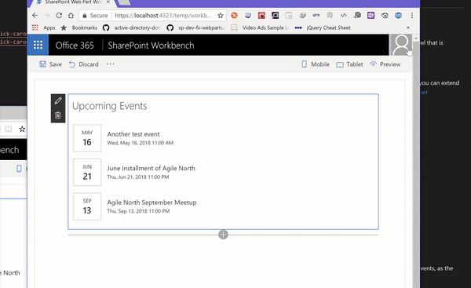
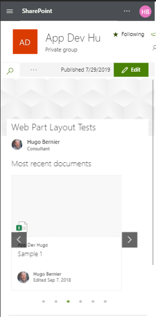
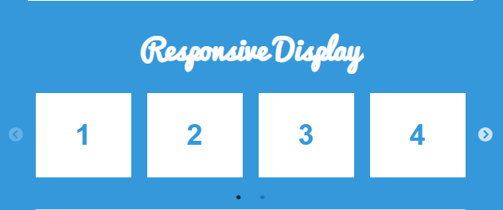

## Introduction

The [SharePoint Design](https://spdesign.azurewebsites.net/) is a beautiful web site that provides design guidance on beautiful and fast sites, pages, and web parts with SharePoint in Office 365.

Unfortunately, the SharePoint Design site does not tell you _how_ to create the beautiful web parts they show you.

[This series](/2019/07/08/introducing-the-sharepoint-framework-design-series/) is intended as a companion to the SharePoint Design site, providing you with code samples and detailed _how-to_ information for every design topic. It should help you create web parts that look exactly like the ones on the SharePoint Design site.

In our [last post](/2019/07/28/sharepoint-framework-design-series-layout-patterns-i/) we discussed layout patterns and showed how to create a **Grid Layout** web part.

In today’s post, we’ll continue our discussion about the [web part layout patterns](https://docs.microsoft.com/sharepoint/dev/design/layout-patterns).

## The Filmstrip layout

Like the grid layout, the filmstrip displays cards to display content. You can use any other rectangular content though. For example, you can use images of kittens, or event cards (as I did with my [Calendar Feed web part](https://github.com/pnp/sp-dev-fx-webparts/tree/master/samples/react-calendar-feed)).



Calendar feed web part switches between filmstrip and compact mode

However, unlike the grid layout, the filmstrip displays items on a single row. As the screen resizes, the filmstrip layout resizes the items to keep the same number of items displayed at once. If there are more items than can be shown at once, the filmstrip will change to a carousel and break items into "pages".


The filmstrip layout resizes items as the page resizes

If you’re a web designer, the word _carousel_ may make you shudder. In fact, if you [search online](https://www.google.com/search?newwindow=1&safe=strict&q=why+carousels+are+bad+design&oq=why+carousels+are+bad+design), you’ll find over fifty-four million search results explaining why carousels are bad.

### Banner blindness

You see, most people have issues with the giant photo carousels on web sites. For most users, the giant photos trigger our [banner blindness](https://en.wikipedia.org/wiki/Banner_blindness) because we automatically assume it is an advertisement, and we ignore it.

Since the carousel in the filmstrip layout does not show a giant image, but a series of smaller images (usually a preview of documents), this isn’t something we have to worry about (although we’ll have to have another conversation when we discuss the **Carousel** layout).

### Mobile issues

Another issue is that giant carousels are notoriously [bad on mobile devices](https://www.nngroup.com/articles/mobile-carousels/).

One of the issues with carousels on mobile devices is that because of limited screen real-estate, it shows only one item at a time. This forces users to use **sequential access**: to view items in the order that is dictated by the control, not by the user’s choice.

[Research shows](https://www.nngroup.com/articles/mobile-carousels/) that — with sequential access — users will stop looking at items after the third or fourth item in a carousel.

Another issue with carousels that people have is with **discoverability**. If someone is in a hurry and they quickly glance at a typical carousel, they may not know that there are more items to see. Most carousels will use a teeny tiny little dot (which are often a [bad design choice](https://www.nngroup.com/articles/4-ios-rules-break/)) to indicate that there are more items.

Fortunately, the mobile version of the filmstrip control uses bigger dots that are as big as the main text with a lot of color contrast to help.



Mobile filmstrip. This isn’t so bad?

If you plan on using the filmstrip layout, follow these guidelines:

- **Limit your items to less than 5:** Otherwise, people may not see the other items.
- **Prioritize your items:** Keep in mind that, depending on the screen size, some users may only see one item at a time. Make sure that you place the most important items first.
- **Make sure items are related:** Because people may not see all items in your filmstrip, make sure that the items you show on the filmstrip are related so that users can predict/easily guess what items are hidden. In other words, don’t put apples and oranges on the filmstrip.

### Accessibility

For me, the biggest concern about most carousels has to do with _accessibility_.

You see, most _evil_ carousels break a lot of accessibility guidelines:

- The dots at the bottom are often too small to see and/or click
- The dots often have a poor color contrast
- The slides often change automatically, without giving users a chance to read the content or slow it down
- The left/right arrows often rely on the use of a mouse, with no keyboard alternatives
- Left/right arrows often have poor color contrasts
- Carousels often do not provide alternative text

Luckily for us, the SharePoint filmstrip (and the carousel layout) doesn’t have many of the typical carousel accessibility issues:

- The slides do not change automatically
- Users can navigate through the slides using the <kbd>←</kbd> and <kbd>→</kbd> keys on their keyboard and use <kbd>TAB</kbd> to cycle through the slides.
- The left/right navigation arrows use a high contrast so that users with color blindness and/or various forms of visual impairment can see them  
    
- The left/right navigation arrows aren’t _too_ small (but they could be bigger)
- The filmstrip provides alternative text for the entire filmstrip (e.g.: "Highlighted content web part, showing Most recent Documents., Use right and left arrow keys to navigate between cards in the film strip."), as well as alternative text for every item in the filmstrip.
- The bullets at the bottom of the filmstrip are still pretty small, but they have high contrast (21:1 on the theme I tested) exceeding the minimum required contrast (4.5:1)

It still isn’t perfect, but it isn’t as bad as most carousel controls out there.

## How the filmstrip layout is implemented

Behind the scenes, the out-of-the-box SharePoint filmstrip and carousel layouts use Ken Wheeler’s awesome [Slick](https://kenwheeler.github.io/slick/) carousel.



The slick carousel as a filmstrip

They simply made it more "Fabric UI" and fixed some accessibility issues.

Unlike the grid layout, which calculates the optimal card size as you resize the page, the filmstrip layout uses _breakpoints_ to use pre-determined settings depending on the dimensions of the filmstrip control.

## How to use the filmstrip layout

Unfortunately — [as was the case with the grid layout](/2019/07/28/sharepoint-framework-design-series-layout-patterns-i/) — there aren’t any ready-to-use controls to create a filmstrip layout web part.

I had to create my own filmstrip layout when I created the [Calendar Feed web part](https://github.com/pnp/sp-dev-fx-webparts/tree/master/samples/react-calendar-feed) for the [SharePoint/sp-dev-fx-webparts repo](https://github.com/pnp/sp-dev-fx-webparts).


Custom filmstrip control in the calendar web part

And since I’m the _world’s laziest developer_ and I hate to write things more than once, I had created the filmstrip component as a re-usable component. (Ok, I had called it `CarouselContainer` back then, but it was really a filmstrip layout control).

For the rest of this post, we’ll use my filmstrip layout control. If you don’t like the one I created, feel free to use your own.

As we did for the [grid layout](/2019/07/28/sharepoint-framework-design-series-layout-patterns-i/), I’ll show you how to insert a copy of my control into your own web parts — that way, you can customize it to suit your own needs.

(Don’t worry, I’ll show you how to move the controls into a component library in a later post, so you won’t have to always copy and paste my code into your solutions)

To create your own filmstrip layout web part, follow these steps:

1. Create a web part solution with the Yeoman generator. For this sample, I’ll call my web part `filmstrip`
2. Copy the `src\components\filmstripLayout` folder from [my project](https://github.com/hugoabernier/WebPartDesignSeries/tree/master/WebPartLayouts/src/components) to yours
3. In your project’s terminal, install the `slick-carousel` and `react-slick` dependencies by using the following command:

    ```bash
    npm i slick-carousel react-slick
    ```

4. In your web part’s component, located at `src\webparts\[YourWebPartName]\components\[YourWebPartName].tsx`, add an import for the `filmstripLayout` control:

    ```typescript
    import { FilmstripLayout } from '../../../components/filmstripLayout';
    ```

5. In your code, load the items you wish to display. You can load an array of any items you wish, but for my sample, I used items with `thumbnail`, `title`, `name`, `profileImageSrc`, `location`, and `activity` props because I want to use the `DocumentCard` control to render my list items. For my sample, I initialized the `state` with a static list of items in my component’s constructor:

    ```typescript
    constructor(props: IFilmstripProps) {
    super(props);
    
    this.state = {
      items: [{
        thumbnail: "https://lorempixel.com/400/200/technics/1/",
        title: "Adventures in SPFx",
        name: "Perry Losselyong",
        profileImageSrc: "https://robohash.org/blanditiisadlabore.png?size=50x50&set=set1",
        location: "SharePoint",
        activity: "3/13/2019"
      }, {
        thumbnail: "https://lorempixel.com/400/200/technics/2",
        title: "The Wild, Untold Story of SharePoint!",
        name: "Ebonee Gallyhaock",
        profileImageSrc: "https://robohash.org/delectusetcorporis.bmp?size=50x50&set=set1",
        location: "SharePoint",
        activity: "6/29/2019"
      }, {
        thumbnail: "https://lorempixel.com/400/200/technics/3",
        title: "Low Code Solutions: PowerApps",
        name: "Seward Keith",
        profileImageSrc: "https://robohash.org/asperioresautquasi.jpg?size=50x50&set=set1",
        location: "PowerApps",
        activity: "12/31/2018"
      }, {
        thumbnail: "https://lorempixel.com/400/200/technics/4",
        title: "Not Your Grandpa's SharePoint",
        name: "Sharona Selkirk",
        profileImageSrc: "https://robohash.org/velnammolestiae.png?size=50x50&set=set1",
        location: "SharePoint",
        activity: "11/20/2018"
      }, {
        thumbnail: "https://lorempixel.com/400/200/technics/5/",
        title: "Get with the Flow",
        name: "Boyce Batstone",
        profileImageSrc: "https://robohash.org/nulladistinctiomollitia.jpg?size=50x50&set=set1",
        location: "Flow",
        activity: "5/26/2019"
      }]
    };
    }
    ```

6. In your `render` method, add a `filmstripLayout` component. You should set the `ariaLabel` prop, but it is optional.

    ```typescript
    public render(): React.ReactElement<IFilmstripProps> {
    return (
      <div className={styles.filmstrip}>
        <FilmstripLayout 
                ariaLabel={"Sample filmstrip layout web part, showing sample items., Use right and left arrow keys to navigate between cards in the film strip."}
    
        >
    
        </FilmstripLayout>
      </div>
    );
    }
    ```

7. To render elements within your filmstrip layout, you simply add rectangular elements as children of the `FilmstripLayout` component. In my sample, I’ll use a `DocumentCard` to render each item. To do so, you’ll need to add the following imports:

    ```typescript
    // Used to render document cards
    import {
    DocumentCard,
    DocumentCardActivity,
    DocumentCardPreview,
    DocumentCardDetails,
    DocumentCardTitle,
    IDocumentCardPreviewProps,
    DocumentCardLocation,
    DocumentCardType
    } from 'office-ui-fabric-react/lib/DocumentCard';
    import { ImageFit } from 'office-ui-fabric-react/lib/Image';
    ```

8. Then, loop through your items and render a `DocumentCard` in your `render` method:

    ```typescript
    public render(): React.ReactElement<IFilmstripProps> {
    return (
      <div className={styles.filmstrip}>
        <FilmstripLayout
        ariaLabel={"Sample filmstrip layout web part, showing sample items., Use right and left arrow keys to navigate between cards in the film strip."}
        >
          {this.state.items.map((item: any, _index: number) => {
            const previewProps: IDocumentCardPreviewProps = {
              previewImages: [
                {
                  previewImageSrc: item.thumbnail,
                  imageFit: ImageFit.cover,
                  height: 130
                }
              ]
            };
    
            return <div
              className={styles.documentTile}
              data-is-focusable={true}
              role="listitem"
              aria-label={item.title}
            >
              <DocumentCard
                type={DocumentCardType.normal}
                onClick={(ev: React.SyntheticEvent<HTMLElement>) => alert("You clicked on an item")}
              >
                <DocumentCardPreview {...previewProps} />
                <DocumentCardLocation location={item.location} />
                <DocumentCardDetails>
                  <DocumentCardTitle
                    title={item.title}
                    shouldTruncate={true}
                  />
                  <DocumentCardActivity
                    activity={item.activity}
                    people={[{ name: item.name, profileImageSrc: item.profileImageSrc }]}
                  />
                </DocumentCardDetails>
              </DocumentCard>
            </div>;
          })}
        </FilmstripLayout>
      </div>
    );
    }
    ```

If I didn’t forget anything, you should see a web part that looks like this:


## Conclusion

The filmstrip layout is a great way to show more items than available screen, but keep in mind that there are accessibility/usability issues with it.

If you want to build a filmstrip layout web part, you can use my [code sample](https://github.com/hugoabernier/WebPartDesignSeries/tree/master/WebPartLayouts) to get started.

In our next post, we’ll continue exploring the web part layout design patterns.

## Photo Credits

- Many of the web part images came from Microsoft’s [Layout patterns page](https://docs.microsoft.com/sharepoint/dev/design/layout-patterns)
- Slick carousel screenshot from [https://kenwheeler.github.io/slick/](https://kenwheeler.github.io/slick/)
