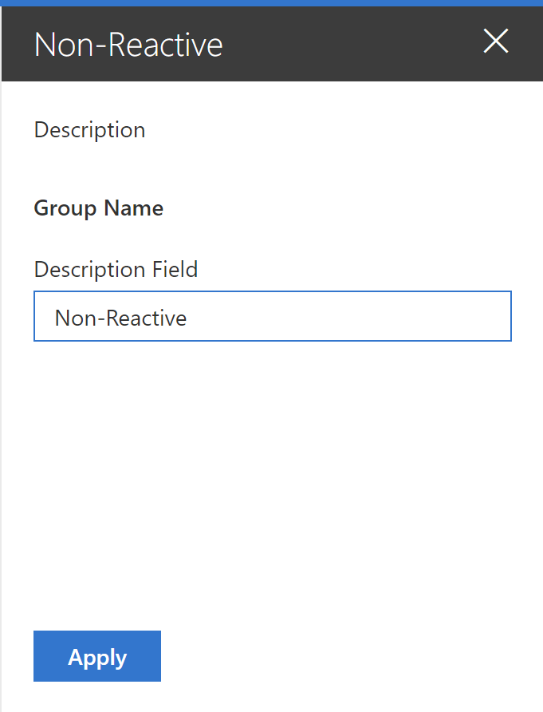
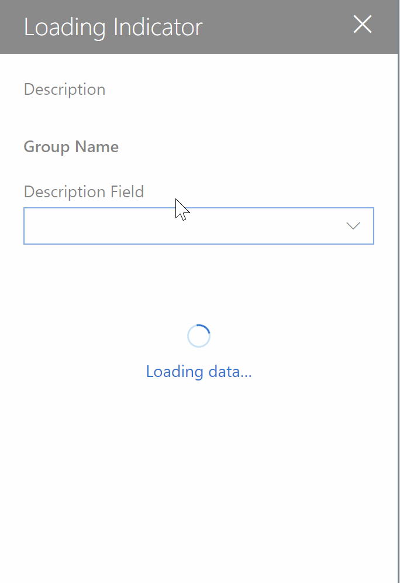
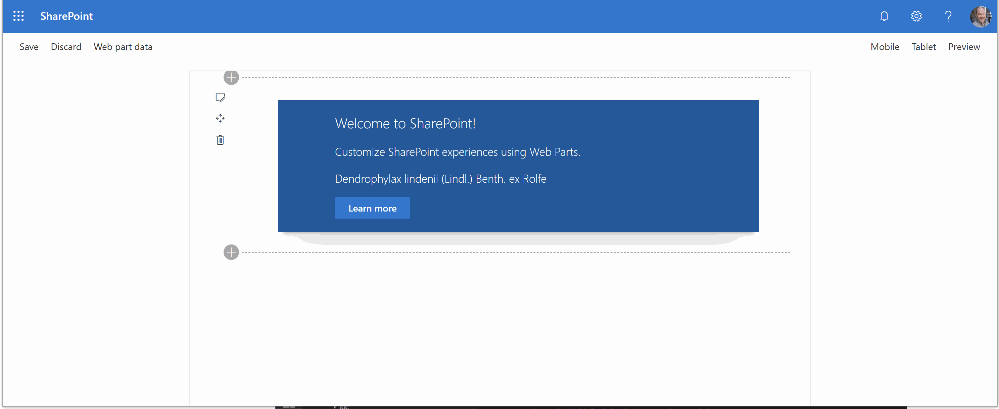

## Introduction

The [SharePoint Design](https://spdesign.azurewebsites.net/) is a beautiful web site that provides design guidance on beautiful and fast sites, pages, and web parts with SharePoint in Office 365.

Unfortunately, the SharePoint Design site does not tell you _how_ to create the beautiful web parts they show you.

[This series](/2019/07/08/introducing-the-sharepoint-framework-design-series/) is intended as a companion to the SharePoint Design site, providing you with code samples and detailed _how-to_ information for every design topic. It should help you create web parts that look exactly like the ones on the SharePoint Design site.

Today’s post continues on [my previous post](/2019/07/12/sharepoint-framework-design-series-property-panes-part-1/). It discusses various aspects of property panes that you may find useful.

Like the previous post, this is a companion to the [**Designing SharePoint web part**](https://docs.microsoft.com/en-us/sharepoint/dev/design/design-a-web-part#property-pane-types) page.

If you want to download the code samples used in this article, download [the solution](https://github.com/hugoabernier/WebPartDesignSeries/tree/master/PropertyPanes) from the [GitHub repo](https://github.com/hugoabernier/WebPartDesignSeries).

## Reactive and non-reactive web parts

By default, when you change settings in a property pane, the changes are immediately reflected within the web part on the page; the web part is considered **reactive**.

Reactive web parts are recommended because it follows the WYSIWYG (what you see if what you get) user experience principles for authoring.

However, sometimes you may not want every change a user makes in the property pane to immediately be reflected in the web part.

For example, if your web part has to load data or call an API every when your user changes settings, you may want to make your web part **non-reactive**.

When you make your web part **non-reactive**, your property pane will add an **Apply** button at the bottom of your property pane. Any changes users make in your property pane will not take effect until they select **Apply**.

To make your web part **non-reactive**, all you need to do define a `disableReactivePropertyChanges` function in your web part, and return `true`. To do so, follow these steps:

1. In your `[YourWebPartName]WebPart.ts` file, find the `getPropertyPaneConfiguration` function.
2. Add the following code before or after (it’s really up to you):

    ```typescript
    protected get disableReactivePropertyChanges(): boolean {
    return true;
    }
    ```

That’s it!

When you run your web part, the property pane will display the **Apply** button we discussed.



## Showing a property pane loading indicator

You may have noticed that most web part property panes do not show a loading indicator. That’s because we always want web parts to appear fast and responsive.



This is what we mean by ‘Loading indicator’

However, sometimes you need to make asynchronous requests to load some data for your property pane, which could take a long time. That’s when you should display a loading indicator to the end-user, so they don’t think your web part has crashed or has become unresponsive.

How long before a user thinks the system has crashed? According to the [**Doherty Threshold** law of user experience](https://daverupert.com/2015/06/doherty-threshold/), you should provide feedback within 400 milliseconds in order to keep your user’s attention and increase their trust in the system.

If your async requests take longer than 400 milliseconds, you should display a loading indicator.

When I want to display a loading indicator in the property pane, I follow these steps:

1. First, you’ll need a variable to store whether you should display the loading indicator or not (otherwise, your loading indicator will always display!). To do so, add a `boolean` variable to you `[YourWebPartName]WebPart` class:

    ```typescript
    export default class LoadingIndicatorWebPart extends BaseClientSideWebPart<ILoadingIndicatorWebPartProps> {
    
    // ADDED: To store whether we should display the loading indicator or not
    private showLoadingIndicator: boolean = true;
    // END: added
    ...
    ```

    In my code, I always initially set it to `true` because I usually only load my asynchronous data once — the first time a user displays the property pane.

2. Add an `onPropertyPaneConfigurationStart` method to your web part class if you don’t already have one. It will get called when preparing the property pane to display. This is where I like to make my asynchronous calls:

    ```typescript
    // ADDED: To display the loading indicator when preparing the property pane
    protected async onPropertyPaneConfigurationStart(): Promise<void> {
    // Call your service
    // Remember that this method gets called *every time* before a user
    // displays the property pane. You should probably verify that your
    // data isn't already loaded before calling your async method again
    this.loadedPlantList = await this.getPlantNames();
    }
    // END: Added
    ```

    Note that in my code, I use an `await` statement to wait until my async call is complete. If you prefer, you could use `this.getPlantNames().then(...)`, but `await` calls are quickly becoming the preferred way to handle async calls in React.

3. Once your data is loaded, set your `showLoadingIndicator` variable to `false` (**line 10**):

    ```typescript
    protected async onPropertyPaneConfigurationStart(): Promise<void> {
    // Call your service
    // Remember that this method gets called *every time* before a user
    // displays the property pane. You should probably verify that your
    // data isn't already loaded before calling your async method again
    this.loadedPlantList = await this.getPlantNames();
    
    //ADDED: To stop displaying the loading indicator
    // When done loading, set the loading indicator to false and refresh
    this.showLoadingIndicator = false;
    //END: Added
    }
    ```

4. To make sure that your property pane updates when you turn the loading indicator on or off, make sure to call `refresh` on the property pane — otherwise it won’t take effect (**line 12**):

    ```typescript
    protected async onPropertyPaneConfigurationStart(): Promise<void> {
    // Call your service
    // Remember that this method gets called *every time* before a user
    // displays the property pane. You should probably verify that your
    // data isn't already loaded before calling your async method again
    this.loadedPlantList = await this.getPlantNames();
    
    // When done loading, set the loading indicator to false and refresh
    this.showLoadingIndicator = false;
    
    //ADDED: To force the property pane to refresh
    this.context.propertyPane.refresh();
    //END: Addd
    }
    ```

5. Finally, in your `getPropertyPaneConfiguration`, set the property pane’s `showLoadingIndicator` prop to the value of your `showLoadingIndicator` variable (**line 4**):

    ```typescript
    protected getPropertyPaneConfiguration(): IPropertyPaneConfiguration {
    return {
      // ADDED: To display a loading indicator
      showLoadingIndicator: this.showLoadingIndicator,
      // END: Added
      pages: [
        {
          header: {
            description: strings.PropertyPaneDescription
          },
          groups: [
            {
              groupName: strings.BasicGroupName,
              groupFields: [
                PropertyPaneDropdown('description', {
                  label: strings.DescriptionFieldLabel,
                  options: this.loadedPlantList
                })
              ]
            }
          ]
        }
      ]
    };
    }
    ```

That’s all you should need to do (in theory). In my code sample, I call a fake service to get a list of plant names and load it in a property pane drop-down box. This is what the final product looks like (note that I exaggerated the delay for demo purposes):



## Delaying the loading indicator

As we discussed, we want to avoid showing the loading indicator if we can. We especially want to _flash_ (i.e.: briefly show) a loading indicator every time we load the property pane.

But you also want to keep in mind the **Doherty Threshold**. Delay a response for longer than 400 milliseconds and people will start clicking around.

Luckily, you can delay the loading indicator and do both!

Let’s pretend that you make a call to a service which _always_ returns with results within 300 milliseconds — except when everyone at work is watching YouTube, then it can take a lot longer. You may want to avoid showing a loading indicator as long as your async calls take less than 300 milliseconds, but start display an indicator if the calls take longer.

All you need to do is add a `loadingIndicatorDelayTime` value to your property pane configuration. The system will wait for whatever delay time you specified before displaying the loading indicator. If you turn off the loading indicator before the delay has elapsed (i.e.: when your async call returns within normal conditions), the loading indicator will never show. However, if you don’t turn off the indicator before the delay period, the loading indicator will automatically start showing.

To do so, change your code as follows:

1. In your web part’s `getPropertyPaneConfiguration` method, add the `loadingIndicatorDelayTime` (**line 5**):

    ```typescript
    protected getPropertyPaneConfiguration(): IPropertyPaneConfiguration {
    return {
      showLoadingIndicator: this.showLoadingIndicator,
      // ADDED: To delay the loading indicator
      loadingIndicatorDelayTime: 300,
      // END: Added
      pages: [
        {
          header: {
            description: strings.PropertyPaneDescription
          },
          groups: [
            {
              groupName: strings.BasicGroupName,
              groupFields: [
                PropertyPaneDropdown('description', {
                  label: strings.DescriptionFieldLabel,
                  options: this.loadedPlantList
                })
              ]
            }
          ]
        }
      ]
    };
    }
    ```

Two things to note:

- If you don’t specify a `loadingIndicatorDelayTime` value, and your `showLoadingIndicator` is set to `true`, SharePoint will wait **500 milliseconds** by default.
- The `loadingIndicatorDelayTime` also seems to delay displaying the property pane until either the delay has elapsed or your `showLoadingIndicator` is set to `false`.

## Conclusion

Today we expanded a little on how to create professional property panes by making them reactive (or not) and by adding a loading indicator when necessary.

There is a lot more to cover on property panes, but we’ll covert it in our next post.

I hope this helps?
