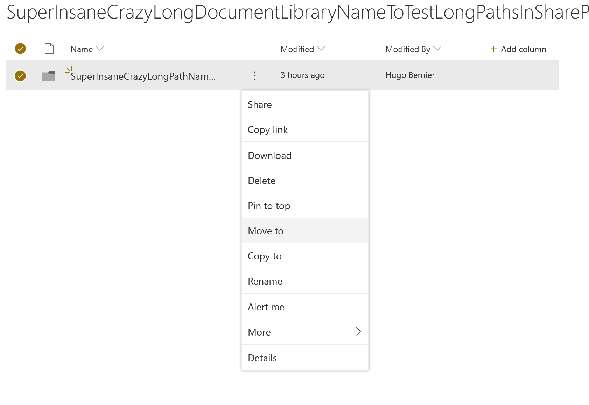

## Introduction


When migrating content from a network file share to SharePoint Online (or SharePoint on premises), remember SharePoint’s URL length limitations.

This article discusses the current limitation with URL lengths in SharePoint. It discusses how this limitation manifests itself, and how it can impact you during your SharePoint migration.

## A matter of legacy

In SharePoint, the limit for a document’s URL is 400 characters long. We’ll discuss this in greater length (see what I did there?) later, but for now, let’s discuss how we get long path names.

To begin with, nobody in their right mind ever says "I think I’ll name my file `SuperInsaneLongFileNameThatIDontEverWantToTypeAgainBecauseItIsTooLong.docx`".

That’d be just annoying.

Instead, people get long path names because of the legacy infrastructure dictated by file shares.

You see, on a network file share, users don’t get the luxury of using metadata or versioning. As a result, users tend to get creative and create folder structures as a substitute to convey metadata.

We’ve [used this example before](/2019/02/24/information-architecture-in-sharepoint-the-metadata-dimension/). Imagine that your users store case files on a network file share. They want to group case files by status, so they case folders for each status under the **Cases** folder:

```
\Cases
    \Open
    \Closed
    \Pending review
```

They also want to group cases by year, so they create a folder for every year in each **Cases > Status** folder:

```
\Cases
    \Open
        \2017
        \2018
        \2019
    \Closed
        \2017
        \2018
        \2019
    \Pending review
        \2017
        \2018
        \2019
```

Each case is placed in the folder matching the year it was received, within the folder for the case status.

Now imagine that, in the process of managing a case, your staff receive electronic evidence, via USB sticks, removable drives, or email attachments — or whatever way. To keep these files together, users start creating folders. Of course, they want to keep track of when they received the files, so they put the files in a folder called **John Smith files received Jan 21, 2019**

Also, because our users want to keep _incoming documents_ (stuff they received during the case management process) from _outgoing documents_ (letters and documents they send out through the case management process), they create separate folders, aptly named **Incoming documents** and **Outgoing documents**.

For example, let’s pretend we have an open case, numbered CA-12345678, from 2019. The folder structure would look like this:

```
\Cases
    \Open
        \2017
        \2018
        \2019
            \CA-12345678
                \Incoming documents
                    \John Smith files received Jan 21, 2019
                        \Photo evidence 1.png
                        \Letter from complainant.pdf
                        \...
    \Closed
        \2017
        \2018
        \2019
    \Pending review
        \2017
        \2018
        \2019
```

Of course, they also want to keep track of outgoing documents they work on, so they name the files accordingly:

```
\Cases
    \Open
        \2017
        \2018
        \2019
            \CA-12345678
                \Incoming documents
                    \John Smith files received Jan 21, 2019
                        \Photo evidence 1.png
                        \Letter from complainant.pdf
                        \...
                \Outgoing documents
                    \Case Summary
                        \Case review v1 Feb 21.docx
                        \Case review v2 Feb 25.docx
                        \Case review v3 Feb 27.docx
                    \Case interviews
                        \Interview with John Smith Jan 23, 2019 raw.mp4
                        \Interview with John Smith Jan 23, 2019 transcript v1.docx
                        \Interview with John Smith Jan 23, 2019 transcript final.docx
                        \Interview with John Smith Jan 23, 2019 transcript final final.docx
    \Closed
        \2017
        \2018
        \2019
    \Pending review
        \2017
        \2018
        \2019
```

And so on.

Users don’t do this to be annoying. They do this because they need a way to manage their information with the tools they have. Without metadata at their disposal, they use long file and folder names.

As long as they keep their file paths shorter than 255 characters, most Windows applications will be able to handle opening and saving files from the file share. This isn’t a limitation of UNC paths, it is a limitation within the apps that try to open and save files (for example, your PDF reader). Depending on the version of Windows you use, and assuming you use applications from _this century_, you can probably get away with longer file paths.

Typically, organizations will map file shares to a drive to make it easier for users. So, instead of having a path that starts with:

```
\\servername\networksharename
```

They’ll have a single letter pointing to the file share. For example, `S:\`. It helps keep the file paths shorter, thus preventing any issues.

Everyone is happy.

Until they try moving the files to SharePoint.

## SharePoint URL Length Limitations

Prior to May 2017, the maximum URL length for a file stored in SharePoint was 255 characters.

Since then, Microsoft [kindly increased the maximum path size to 400 characters](https://blogs.technet.microsoft.com/wbaer/2017/05/09/new-maxpath-limits-in-sharepoint-and-onedrive/).

> When I say 400 characters, I really mean 400 _unicode units_. If you use International characters with multibyte values, you actually get _less_ that 400 characters.

"So what? Our file names are less than 400 characters", you may ask.

You see, the URL is for the _entire_ URL of the file, including:  
`https:\\`**yourtenant**`.sharepoint.com/sites/`**yoursitename**`/`**yourdocumentlibraryname**`/`**yourfolderpath**`/`**subfolderpath**`/`**Filename.extension**`/?`**parameters**

For example, let’s say your tenant is called **Contoso**, your site called **Case Management**, and your document library called **Shared documents**. On your file share, that file path that started with:

```
S:\
```

…when migrated to SharePoint, will become:

```
https://contoso.sharepoint.com/sites/case%20management/shared%20documents/
```

That’s a whopping extra **71 characters added to your file names**. Those file paths that didn’t cause any issues on a network file share can suddenly be _too long_ once migrated to SharePoint.

## How long URLs manifest themselves

### No issues when uploading documents

Here is the problem: you may be able to migrate your documents to SharePoint — even if they have long file names that exceed the maximum path length.

### Errors opening documents online

However, when you try to open the file, you get an error. For example, here is what happens when I try to open a document with Word online:  


### Errors opening documents using desktop applications

What’s worse, if your users are on an older version of Windows, or if they use a Mac, they may experience issues with file paths around the 255 character length!

Also, if they try to **Sync** the files to **OneDrive for Business**, and they try to open documents using older desktop applications, they may get an error indicating that the **"file could not be opened"** or the ever-mysterious **"an error has occurred"**.

### "Some files work, some files don’t"

Users may experience an issue when only a few documents (or folders) won’t open, but other files open without problems.

This usually happens with file names that have different lengths. Shorter file names open without issues because the full paths are less than 400 characters. Longer file names don’t open because the file names are longer than 400 characters.

To regular users, it seems like a random issue.

But you and I know better, don’t we?!

## How to solve the URL length issue

You migrated your file share to SharePoint without getting any errors while uploading the documents.

Everything looks good.

Then a user tries to open a document with a URL that exceeds the limit. And they get an error. Of course, this always happens with someone very high up in your company, usually _minutes_ before a very important event.

### Move files to a shorter URL

The easiest way to solve this problem: use SharePoint’s **Move** functionality within a document library to move the file to a shorter URL.



For example, if the file is 5 folders deep in a document library, try moving the file to the root of that document library.

It may shorten the URL with enough precious characters to allow you to open the file.

Then have **the talk** (you know, the one about _why you should use shorter folder names and file names_) with your users.

### Errors with custom code

If you use custom code to connect to SharePoint using REST, you may also run into issues when the full URL for the REST call exceeds the limit.

One way to solve this problem is to use **GetFileById** and pass the unique file id instead of trying to use the file name:

`https://`**yourtenant**`.sharepoint.com/sites/`**yoursitename**`/_api/web/GetFileById('`**fileid**`')`

## How to test URL length limits

When I tested the maximum URL length for this article I manually created super-long file names.

Fortunately, you don’t have to do that. Thanks to **Rene Modery**, you can use a [script to create long file paths](https://modery.net/increased-path-length-for-files-in-sharepoint-online-and-onedrive/). It uses [the SharePoint PnP cmdlets](https://docs.microsoft.com/en-us/powershell/sharepoint/sharepoint-pnp/sharepoint-pnp-cmdlets?view=sharepoint-ps) to connect to SharePoint and create long paths for you.

## Conclusion

When planning a SharePoint migration, pay attention to long path names. You may be able to migrate the documents without issues, but your users will run into issues opening documents.

If your users work with older desktop applications, older versions of Windows, or Macs, you may want to stick to a maximum URL length of fewer than 255 characters.

If your users have the latest version of Windows and Office, you can safely plan for maximum server-relative URL lengths (i.e.: the URL without the **[https://\[yourtenant\].sharepoint.com](https://yourtenant/)**) of 400 characters.

Of course, after your content is migrated, help your users understand why they shouldn’t use silly long file and folder names anymore and show them how to use **metadata**.

I hope this will save you some headaches in the future.

## Update

> Contrary to Microsoft’s [own article](https://blogs.technet.microsoft.com/wbaer/2017/05/09/new-maxpath-limits-in-sharepoint-and-onedrive/), it appears the 400 character limit no longer counts the **[https://\[yourtenant\].sharepoint.com/](https://yourtenant/)** or the parameters (e.g.: **?web=1**) in the URL length. The limit of 400 characters applies to the **server-relative file path**.
>
> When a URL contains special characters, like **space**, **%**, **#**, etc., the characters get URL-encoded. For example, space will be encoded as **%20**. When verifying if your file URL to shorter than 400 characters, SharePoint uses the un-encoded URL (i.e.: special characters count as 1 character).

## For more information

- [Increased Path Length for Files in SharePoint Online and OneDrive](https://modery.net/increased-path-length-for-files-in-sharepoint-online-and-onedrive/), Rene Modery
- [New MAXPATH limits in SharePoint and OneDrive](https://blogs.technet.microsoft.com/wbaer/2017/05/09/new-maxpath-limits-in-sharepoint-and-onedrive/), Bill Baer (Microsoft).
