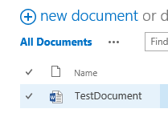

## Introduction

When migrating from SharePoint on-premises to SharePoint Online/Office 365, you may find that some users have a checked-out file called `spcommon[1].png`. If you ask users about it, they’ll have no idea what you’re talking about.

As it turns out, this isn’t a bug. It is possible for users to check-out this file without knowing they did it.

But for this issue to occur, you need a "perfect storm" to happen: a series of things that occur that are seemingly unrelated that results in the issue we’re discussing today.

## What is spcommon\[1\].png

`spcommon.png` is an image that SharePoint uses to render things like checkboxes, arrows, gears, and pretty much any icon that you see on a SharePoint page.

If you download the file, it looks like a bunch of icons in one bigger image:  

Those types of images are called _sprites_; they usually consist of many images grouped together as a single image. That image is bigger to download than individual images, but since most browsers try to avoid re-downloading a file it has already downloaded (something known as _caching_ — pronounced _cashing_) — making the entire page load faster.

SharePoint uses the giant sprite and hides irrelevant parts of the image (by setting a `background-url` and `background-position` CSS styles).

On a typical SharePoint page, the `spcommon.png` image may be shown dozens of times.

So why do I get a `spcommon[1].png` file that gets checked out by users?

## Perfect Storm

This issue will typically happen in document libraries that either **Require check-out before editing files** or that have a mandatory property.

I’ve seen this issue in SharePoint 2013 and SharePoint 2016 migrations, but it could potentially happen in SharePoint 2019 as well.

As you already know, users can drag and drop documents unto a document library using their browsers, and SharePoint will try to upload the document.

If you try drag and drop a document to a library that requires checking in or one that has mandatory properties, the newly uploaded document will be checked out until the user provides values for the mandatory properties and checks the document in.

Most browsers also allow you to select an image from a web page and drag and drop it. (Try it now with an image on this page!).

If you try to drag and drop an image onto a document library page, it will try to upload that image into the document library. If that library has mandatory properties, the image will be uploaded but checked-out.

Here is where it gets crazy: if a user tries to click on the checkmark next to a document and _accidentally drags the mouse instead_ — even for a few pixels — the browser will think that the user meant to upload the image to the document library.

And the image used to display the checkbox is — you guessed it —`spcommon.png`.

It often happens too quickly for users to notice, but here is what happens if you slow it down and take a screen shot of a user dragging the checkmark icon in a document library:

And since most browsers will try to uniquely name dragged files, the `spcommon.png` file is automatically renamed to `spcommon[1].png`.

## Conclusion

The issue with a mysterious checked-out `spcommon[1].png` file in a document library requires a lot of factors to happen.

Fortunately, It seems that newer versions/patches of SharePoint prevent this issue from happening by giving users an error message saying "Folders and invalid files can’t be dragged to upload", meaning that you’re less likely to find this issue in future migrations.

If you see this error when migrating files to SharePoint Online, you can safely ignore it.
